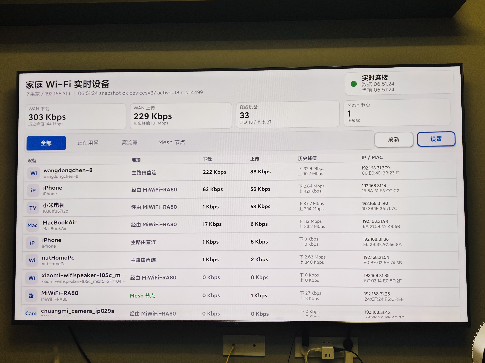
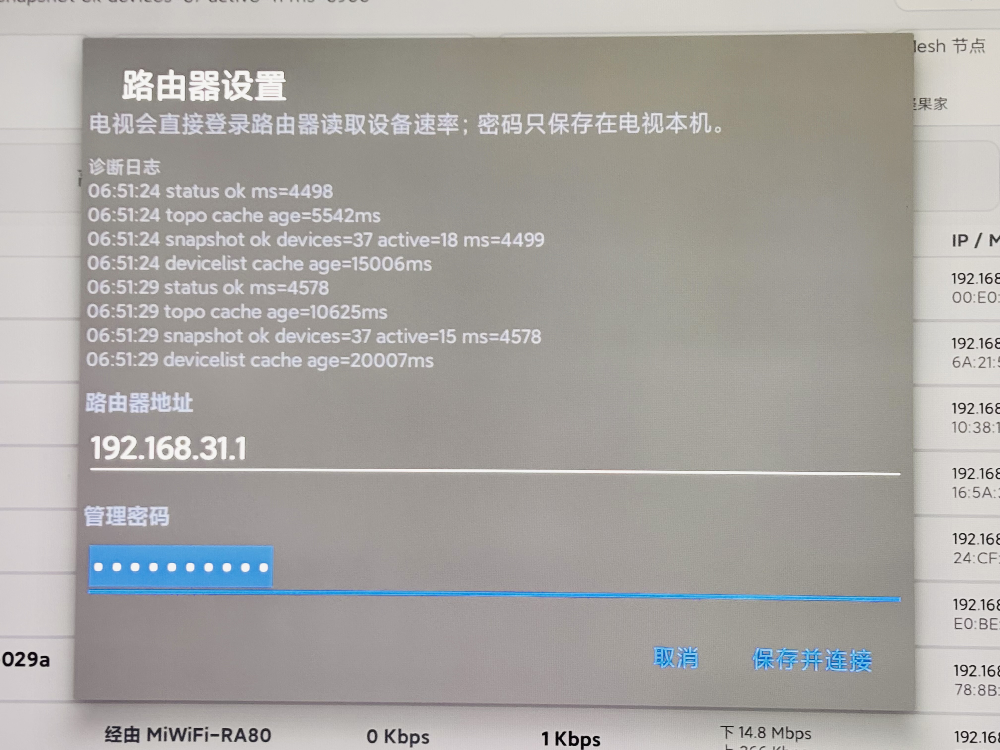

# Home Wi-Fi Monitor TV

[中文](README.md) | [English](README.en.md)

A local-first Android TV dashboard for monitoring home Wi-Fi device traffic. The current implementation talks directly to Xiaomi/MiWiFi-compatible router management APIs, reads connected devices, real-time bandwidth, WAN upload/download, and Mesh node information, and runs on the TV without a companion computer after installation.

It is especially useful for people who want to see what is happening on their home network but do not run a soft router, OpenWrt box, side router, or professional gateway. If your router exposes connected-device and bandwidth data, this project can turn an Android TV into an always-on home network monitoring panel.

## Screenshots

<p align="center">
  
</p>

<p align="center">
  
</p>

## Features

- Landscape Android TV interface designed for D-pad and remote-control navigation.
- One-second dashboard refresh, with caching for slower router endpoints to reduce router UI load.
- WAN download/upload, online devices, active devices, Mesh nodes, and per-device speed rows.
- First-launch router settings dialog; router host and admin password stay on the TV device.
- Device filters: all devices, active devices, heavy traffic, and Mesh nodes.
- Optional Node.js browser dashboard for local debugging and router parser testing.

## Keywords

Xiaomi router, MiWiFi, home Wi-Fi, home wifi, home network, network monitor, traffic monitor, bandwidth monitor, monitoring dashboard, Android TV dashboard, router monitor, LAN monitor, device bandwidth, no soft router, home network panel.

## Requirements And Limitations

This project is based on Xiaomi/MiWiFi-style local router management APIs. It is not a universal router monitoring protocol.

Before using it, make sure:

- You own the router admin account and password.
- The TV, router, and optional debugging machine are on the same trusted home LAN.
- Your router management UI exposes the current connected device list and per-device upload/download bandwidth.
- Your router API response structure is compatible with Xiaomi/MiWiFi routers; different models and firmware versions may need adaptation.

About refresh frequency:

- The dashboard UI can refresh every second, but the actual freshness depends on how often the router firmware updates its bandwidth data.
- Slower endpoints such as device lists and Mesh topology are cached to avoid repeatedly hitting the router management UI every second.
- If values do not visibly change every second, the usual reason is the router API update interval or router load limit, not something the TV app can fully solve by itself.

## Adapting With AI

Although this version was built for Xiaomi/MiWiFi routers, it can also serve as a reference project for building a home router TV dashboard. You can give this repository to an AI assistant, describe your own home environment, and ask it to adapt the project quickly.

Useful context to provide:

- Router brand, model, and firmware version.
- Router admin URL, login flow, and sample API responses.
- Where device name, IP, MAC, upload speed, and download speed appear in your router response.
- Target TV or Android box version, screen resolution, and remote-control behavior.
- Which UI parts you want to keep and which private runtime fields you want to hide.

For non-Xiaomi routers, the main work is usually in `RouterClient`: login, API requests, and response parsing. The TV UI, filters, refresh cadence, and local-only architecture can often remain useful.

## Tech Stack Notes

This repository uses the following stack because it is what this implementation needed. It is not a requirement for forks or adaptations.

- Android TV app: native Android Java.
- Build: Android Gradle Plugin 8.7.3, JDK 17.
- Local browser dashboard: Node.js ES Modules.
- Tests: Node.js `node:test` and Android unit tests.
- Architecture: the TV app calls local router APIs directly; no cloud service is required.

You can ask AI to adapt the stack for your needs: Kotlin instead of Java, a different UI, a different router API, removing the browser dashboard, or adding more local statistics.

The code was mainly AI-assisted and is best treated as a learning, self-hosting, and home-use starting point. Test it against your own router model, firmware, and network environment before relying on it.

## Repository Layout

```text
android-tv/       Android TV app source
web-dashboard/    Optional Node.js browser dashboard and parser tests
docs/images/      Images used by the README files
LICENSE           MIT license
README.md         Chinese main entry
README.en.md      English README
```

## Android TV App

Requirements:

- Android Studio or a compatible Android SDK
- JDK 17
- Gradle compatible with Android Gradle Plugin 8.7.3

Debug build:

```bash
cd android-tv
gradle assembleDebug
```

Release build:

```bash
cd android-tv
gradle assembleRelease
```

On first launch, enter your router admin host and password in the settings dialog. The host can be any local hostname or address reachable from the TV on your home network.

Remote-control shortcuts:

- D-pad: move through filters, buttons, and device rows
- Menu or Settings key: open router settings
- Refresh key or `R`: refresh immediately
- Channel/Page keys: scroll the device list

## Browser Dashboard

The browser dashboard is optional and mainly useful for development and router parser debugging.

```bash
cd web-dashboard
npm test
cp .env.example .env
```

Edit `.env` with your router host and password, then start:

```bash
npm start
```

By default it only binds to `localhost`. If you expose it to other devices on your home network, set `BIND_HOST` yourself and remember that the browser dashboard has no built-in authentication.

## Configuration

`web-dashboard/.env.example` documents the supported local environment variables:

- `ROUTER_HOST`: router admin host reachable from the machine running the browser dashboard
- `ROUTER_PASSWORD`: router admin password
- `PORT`: browser dashboard port
- `BIND_HOST`: browser dashboard bind host
- `SNAPSHOT_TTL_MS`: short snapshot cache window

The Android TV app stores configuration through the on-TV settings dialog instead of a committed config file.

## Privacy And Security

This project is intended for trusted home LAN use.

- No telemetry, analytics, cloud sync, or external API calls are included.
- Source code does not hard-code router hosts, admin passwords, device names, local IPs, or MAC addresses.
- APK files, local environment files, signing keys, and `local.properties` are not committed.
- Runtime router data may include device names, IP addresses, and MAC addresses. Decide whether to redact your own screenshots or logs before publishing them.
- The browser dashboard has no built-in authentication and should normally stay bound to `localhost`.

## License

MIT

## Contact

For technical discussion about Android TV, home network monitoring, Xiaomi router local APIs, or adapting this project, scan the WeChat QR code below.

<p align="center">
  
</p>
